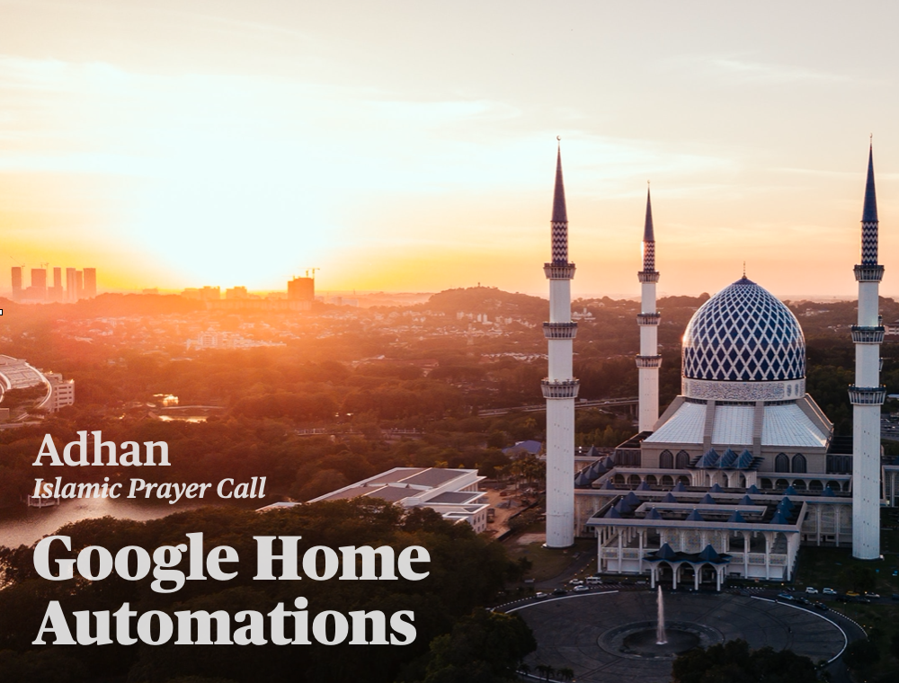

 
## Video:

[](http://www.youtube.com/watch?v=E_qlDUX1QNU "Automate Playing Adhan on Google Home")

### Download:
[Project files](https://gitlab.com/shariatpurbasi/islamic-prayer-call-assistant/-/archive/master/islamic-prayer-call-assistant-master.zip)


>### **automations.yaml file**
>For 'entity_id' change the device name to your device name.  
>*example:* **entity_id: media_player.living_room_speaker**  
>           **entity_id: media_player.[name]**


### Commands:

Open Terminal and navigate to the islamic-prayer-call-assistant-master download folder.

Run the following commands:
```
docker-compose down
docker system prune -a
docker-compose up -d
```
Open browser and visit:
http://0.0.0.0:8123/
